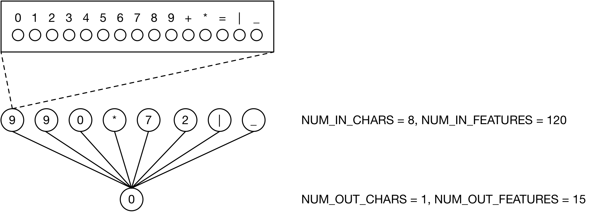

# Overview

| datasets         | description                                  |
| ---------------- | -------------------------------------------- |
| mult999.datasets | multiplications, suitable for (NNs and) RNNs |

| module             | description      | type                | accuracy |
| ------------------ | ---------------- | ------------------- | -------: |
| mult999.first.nn0  | predict 1st char | NN (simple)         |     100% |
| mult999.second.nn1 | predict 2nd char | NN (1 hidden layer) |          |

requirements: Python 3.5/3.6, TensorFlow 1.9.0

# Models

## mult999.first.nn0

